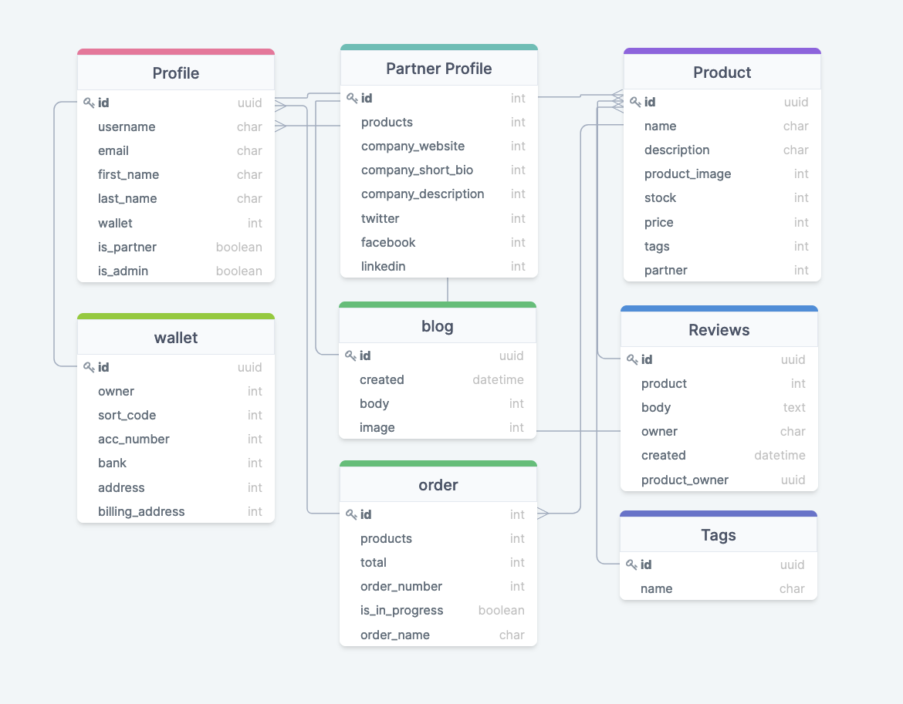

# README for Mixed-origins.com
 
## Info
 
Mixed-Origins.com is an e-commerce website that gives a platform for product creators who focus on creating exciting and necessary products for the Mixed Race community. They are looking to launch later this year and have asked for a styled website with dummy data to show prospective brands that align with its values. 

Mixed origins is a new concept 
 
 

 
[live site](https://mixed-origin-ms4.herokuapp.com/)
 
## Index
 
- <a
href="#ux">UX</a>
- <a
href="#design">Design</a>
- <a
href="#testing">Testing</a>
- <a
href="#deployment">Deployment</a>
- <a
href="#future">Future Features</a>
- <a
href="#credits">
Credits
</a>
 
## The App Brief
 
The company concept and proposition can be accessed [here](/static/assets/readme/concept.md)

A copy of the brief can be accessed [here](/static/assets/readme/design_brief.md)

Some of the colour hue's have changes slightly on client testing and feedback.
 
## Summary Of The Brief
 
The client has requested a web app that has full functionality as an e-commerce store, must be styled and follow assumed functionality and layout from both users and partners.
 
This project will be used on a closed server as part of the marketing material to attract potential brands to the platform ready for when they launch later on in the year. 
 
This website will be used as a showcase to present the business to perspective brands; therefore, the web app must demonstrate an essential but complete user journey for both the brands(partners) and potential shoppers(users).
 
<span
id="ux">
</span>
 
## UX
 
### Target Audience
 
There is more detail for the target audience in the website brief. However, as the web app operates as a platform, there are two categories of the audience that the app needs to service.
 
### Partner
 
Partners; are SME businesses that produce products aimed at the Mixed Race community. Potentially does not have a massive online presence, and that can see being part of the platform to increase the companies sales and revenue.
 
### Users
 
Users; are customers with either mixed heritage backgrounds or in a mixed household who are looking for an easier way yot find products specifically for the unique needs that they face, which are currently not catered for on mainstream sites.
 
## Website Goals
 
### Client
 
To make a web application that:
 
- is easy to use and understand
- will motivate/draw users back to the site each week
- needs to be responsive on mobile and desktop
 
### Users
 
As a user, I want:
 
- to be able to find and search for items easily
- to be able to add these products to my cart
- to be able to buy these items easily
- to have a record of the items I have purchased and have it sent to my email
- to have some way that I can record my details for continued use of the site
 
### Partners
 
As a partner, I want:
 
- to be able to create an account 
- to be able to add my brand to my ‘shop.’
- to be able to add items to my shop easily
- to be able to record item stock levels
- to be able to update my ‘shop’ profile
- to be able to update any item details that I have on my shop
 
### Functions for the app
 
The app must:
 
- have the ability to have different user profiles
- have the ability to search for items and purchase them
- have a cart of bag functionality
- have a checkout function allowing to take online payments
- have the ability for partners to be able to add products to the store
 
## User Journey
 
Here are examples of successful user journeys.
 
Here is the successful journey of a user.
 
- I have been redirected to the app via a marketing campaign.
- I have noticed a product I would like to buy.
- I have clicked to view more information about the product to see if it matches my needs.
- I have selected an amount to purchase.
- I received some sort of feedback from the app letting me know it has been successful
- After more shopping, I can see my whole order in the cart/bag feature.
- I can enter my details for delivery
- I can then use an online payment form to process my payment.
- I received a verification email about the order.
- I liked the experience, so I created a profile and saved my details
 
Here is the successful journey of a Partner.
 
- I am looking to increase my revenue and online presence for my brand.
- I get directed to Mixed-Origins.com via social media adverts.
- I have a look at other brands who are selling on the web app
- I have created a user account
- I have requested to become a partner
- I have been accepted to sell on the store
- I can now create my profile where I can promote my store
- I can add products to my store for sale
- I am now receiving orders
 
## User Stories
 
These user stories revolve around essential actions for each user and the desired software outcome to satisfy the user need.
The user stories that I use to build the functionality of the app are available [here](static/assets/readme/user_stories.md)
 
## Sections of the Web App
 
### General Layout
 
The client is not looking for an MVP; they need something that they can use to promote the brand and bring in brands to become part of the community of sellers on the platform.
 
### Navigation Bar
 
The navigation bar should be simple and easy to understand.  The user should be able to identify if they are logged in or not. This bar should only have the relevant information available for the user. I.e. not showing login option when logged in.
 
Must have a quick and easy way to access filtered product searches, possible by category in a drop-down menu. 
 
This will be hidden on smaller screens and replaced with a pop-out menu.
 
### Home page
 
The home page should be quick and easy to navigate. Which follows the standard navigation practices, copy about the project must be visible, the design must think about potential promoted space where brands could be charged a premium for HTML real estate.
 
### User and Partner Profile pages
 
The profile page must have all the basic user information, with an easily identifiable way to update data. Must not be cluttered with information; details can be split over pages.
 
### Products page
 
The product page should be easy to navigate, with no clutter, just simple cards showing each product with an easily identifiable way to narrow down product searches.
 
Products on the page must be paginated to a reasonable amount.
 
### Product view page
 
The product view page should show more detailed information about the product, with a quick and straightforward way to choose an amount to order and then order.
 
### Partners pages
 
The partner's page should show all our partners on bigger displayed cards than the products, must show the given selected image from each brand, and have a link to the brand page. 
 
Must have search by name options.
 
### Partner pages
 
The partner page should show more details about the story of the brand and have a link so the user can see all the products by the given brand.
 
### Cart and Checkout pages
 
The cart and checkout pages should be similar in design and layout.
 
Should be plain to allow the user to focus on nothing else but finishing the order.
 
## Wireframes
 
Here is a sample of the original wireframes for the app approved by the client.
 


The signed off final design for the website changed due to client feedback on the use of the site.

All the initial wireframes are available in the wireframes folder in the repo. 

<span
id="design">
</span>
 
## Design
 
The design elements were influenced and informed by the client’s brief. The unique design is kept to a minimum and follows industry standards on the look and navigation of the site.
 
### Font
 
### Copy
 
- Poppins and as a backup sans-serif
 
### Headers
 
- Abril Fatface and as a backup cursive
 
### Main colours
 
Brand colours can be found in the design_brief.
 
## Features for the website
 
### Responsive design
 
- Websites must be functional on both large and small screens.
 
### Interactive page
 
- Page HTML must be interactive for the user and must feel fluid.
 
## Technologies Used
 
### Languages
 
HTML5 - I used HTML 5 for the layout and structure of the website.
 
CSS - CSS has been used to style some HTML elements.
 
JQuery - jQuery language has been used to create front end interactivity of some HTML elements from Materialize CSS.
 
JavaScript - I have used custom JS to add to the interactivity of DOM elements.
 
Python - Python has been used so the app can interact with the database.
 
Postgres- I chose to use Postgres as the database to store all of the necessary data that the app uses.
 
Django Template - This language was used to manipulate the HTML depending on what data returned from various Python functions.
 
## Frameworks
 
## App - Django
 
I used the Django framework to build the app. This framework has sped up the coding process and given a solid foundation to the app.
 
## Styling - Materialize
 
I have used Google Materialize to standardize the styling of this app. For example, selecting the elements I want and then copying and pasting the code into the HTML and any jQuery code needed to make the element interactive.
 
## Python Libraries
 
I used modules to help me code the app faster using pre-written code to speed up the process.
 
- os - This module allows the app to have access to the operating system, giving the app the ability to access environment variables.
- Django - This module is the framework for the app, allowing the app to have a user and connect to other apps.
- DateTime - This module has been used to record timestamps by the app.
- UUID - I used this module to create ids for database entries.
 
## Outside Libraries
 
- Font Awesome - I used font awesome for some of my icons.
 
## App Dependencies
 
The full list of dependencies can be found [here](requirements.txt)
 
## Software Used
 
- Git: I used Git to manage the app's development, committing regularly.
 
- Git Desktop: I used this to manage commits and push them to the GitHub repository.
 
- GitHub: I used GitHub to store the version of the project remotely.
 
- Adobe XD: I used XD to create and build the wireframes.
 
## VS Code
 
I used VS Code as my code editor. In the code editor, the extensions that I used were:
 
- Black: automatically format my code for basic formatting mistakes and have a consistent style throughout the code.
- Image preview: I used this extension to identify whether or not the image URL path is correct.
- Markdown all in one: I used this extension to help me edit the readme file in VS Code.
  
## Coding Architecture
 
I have used a simple architecture for this app with all the code from each language in one file and separated the code into sections by comment lines.
 
## Database
 
I used SQL lite in the production and then Postgres for deployment to Heroku.
 
Both are Relational Databases, which create a table for each object that a relationship can link together.
 
### Schema
 
I am using various relationships to connect each database table, for example:
 
Many to many - I am using this relationship to connect Product and Tag tables, as each product can have more than one tag, and each tag can be assigned more than one product.
One to many - I used this relationship to connect partners with the products. They have in their store, as one brand can have many products for sale. 
One to one - I used this relationship between profiles and wallets.
 
<details
>
 
<summary
>Click here to view the database</summary>
 


</details> 

## User Input Validation
 
Using Django models, and is_valid to validate user input data. Ass the validation is done on the backend it make the app safer to being hacked and manipulated through the HTML.
 
 
## Online Resources
 
These are the online resources that I used throughout the project.
 
### [Materialize](https://materializecss.com/)
 
### [Stack Overflow](https://stackoverflow.com/)
 
### [YouTube](https://www.youtube.com/)
 
<span
id="testing">
</span>
 
## Testing
 
### Automated Code Validation
 
I used unit tests for some of the URLs, Views, Models and Forms. Once hardcoded and checked, these tests are designed to be run before each commit.
The tests are in the Github repository in each apps perspective folder.
 
### HTML Test

I used a firefox extension to test html code, this allows you to navigate the site, while checking the code against [W3C HTML validator](https://validator.w3.org/) standard HTML practices. To test the HTML I view the page source from right clicking on the live page and copied the code from there.

I had an occurring error throughout out my code, this is due to the stripe extension in my code, I have decided not to change any of this code, as I am not sure how to fixe the errors, and keeping the code working.
 
- Home - Pass
- Profile - Pass
- edit_profile - Pass
- edit_partner - Pass
- orders - Pass
- wallet - Pass
- products - Pass
- view_products - Pass
- product_list - Pass
- add_product - Pass
- edit_product - Pass
- partner_products - Pass
- partner_profile - Pass
- blog - Pass
- about_us - Pass
- checkout - Pass
- checkout_success - Pass
- cart - Pass
- partners - Pass
 
### CSS Test
 
I used the [W3C CSS validator](https://jigsaw.w3.org/css-validator/) to validate the css:
 
- style.css - Pass - With no Errors, I had many warnings, they were due to the fact that I am using variables and vendor extended pseudo-class.
 
### JavaScript Test
 
I used [JSHint](https://jshint.com/) to validate the 
JavaScript:

I used these options for the JSHint validation.

```
/*jshint esversion: 6 */
/*global $:false*/
```
- script.js - Pass

Added the stripe variable for the validation for the stripe.js 

`/* global Stripe:false */`

- stripe_element.js - Pass
 
Added the stripe variable for the validation for the stripe_element.js 

`/* global Stripe:false */`

### Python Tests
 
I used [PEP8 online](http://pep8online.com/) to validate the Python:

One thing error that came up was checking boolean is equal to by using `==` instead of `is`.
 
All files passed through the online pep8 checker with no errors or warnings.
 
## Manual Testing
 
### Testing Environments
 
I used two sets of hardware to undergo building and testing the app; I used a 2012 28 inch iMac and a 2020 13inch Macbook air with the M1 processor. On both, I was using Google Chrome and Firefox web browsers.
 
### Desktop Testing
 
Platforms :
 
- MacBook Air 2020 M1 - OS Big Sur
- Mac - OS Catalina
 
Browsers:
 
- Chrome
- Firefox
- Safari
 
Mobile testing:
 
- Pixel 4 (Android 11)
- iPhone 12 (IOS 14)
 
Browsers:
 
- Chrome
- Safari
<span
id="testing-responsive">
</span>
 
## Testing - Design Responsiveness
 
### Simulated Testing
 
I used the Google Developer tools to simulate different screen sizes for each of the pages in the app.
 
Tested with Chrome DevTools using profiles for with screen sizes:
 
- Moto G4
- Galaxy S5
- Pixel 2
- Pixel 2 XL
- iPhone 5 SE
- iPhone 6/7/8
- iPhone 6/7/8 Plus
- iPhone X
- iPad
- iPad Pro
 
I also used the responsive profiles preset in the dev tools of:
 
- Mobile S (320px)
- Mobile M (375px)
- Mobile L (425px)
- Tablet (768px)
- Laptop (1024px)
- Laptop L (1440px)
 
## Major Testing Issues Identified
 
 
## UserTtesting
 
I gave the app to three people to test and to populate the database with data.
 
### User Tests
 
1. **User One** - This user accessed the app via Dell Laptop:
        This user had a problem when setting up the app on a local device, after helping this user get the app working, I created more in depth steps to setting up the app. I noticed that without an initial Partner Profile the app would not work. This user found no other issues using the app.
2. **User Two** - This user accessed the app via Mobile:
        This user experience some problems with the formatting on some of the pages, this was due to image and box sizes.  

 
## Testing User Stories Checklists
 
The checklist and notes from the user stories are [here](static/assets/readme/user_stories_checklist.md)
 
### CRUD Database tests
 
Create
 
- Create a profile - check
- Create a partner - check
- Create a product - check
- Create a wallet - check
- Create a order - check
- Create a tag - check
 
 
Read
 
- Read all the product data - check
- Read profile data - check
 
Update
 
- Update a profile - check
- Update a partner - check
- Update a product - check
- Update a wallet - check 
 
Delete
 
- Delete a user from the database - check
- Delete a product from the database - check
- Delete a partner from the database - check
 
 
### Functionality Testing
 
### Users
 
- to be able to find and search for items easily - check
- to be able to add these products to my cart - check
- to be able to buy these items easily - check
- to have a record of the items I have purchased and have them sent to my email - check
- to have some way that I can record my details for continued use of the site - check
 
### Partners
 
- to be able to create an account - check
- to be able to add my brand to my ‘shop’ - check
- to be able to add items to my shop easily - check
- to be able to record item stock levels - check
- to be able to update my ‘shop’ profile - check
- to be able to update any item details that I have in my shop - check
 
## Issues and Challenges I Encountered
 
The biggest issue I found in the development of this application was the storing of images, as image files are likely to be uploaded as jpg files, which would slow the website download speeds. So I researched how to do this in the model, which took a few days to get right in the development env. Try to implement this into the code proved to be very difficult and created problem's throughout the app in development and in the Heroku version of the app. This has resulted in the function not being finished.
 
## Known Bugs
 
- Webp Image bug - There is a bug in the Heroku version of the app, webp images are not being saved on the server. This is a problem as this slows down the website for the live version. As some browsers do not support webp format, in these instance's I have coded an `onerror` option into the HTML, so the original image upload will be used.
  
- Deletion of webp images - There is a bug in the final code in the local env, on the edit or deletion of a product the webp version of the stored image is not deleted. At one stage there was code to clear this file, however this created a issue in the Heroku version of the app.  
  
- Stripe payment input box - On some small screens this is misshapen, I struggled to find a solution to change the css of a stripe object. With more time I am looking to change this. 

- Favicon.ico I have not decided to have a favicon icon in the tab of the browser, but I get an error sometime appear in the terminal. I do not know where in the code base this is being called from to get an error. I assume it is coming from a module I have installed, so I am reluctant to start deleting lines of code from a module incase it stop working.

- I had an issue with Chrome at one point, on an update the file upload browser button would not trigger the finder to let you select an image to upload, this would happen in the web app and also the admin backend.

- Debug Images - When Debug is set to `False` on the development server can create a bug where the server cannot find the media files, when set to `True` all works fine.
 
<span
id="deployment">
</span>
 
# Deployment
 
I used one GitHub branch, so clone the main branch in the repo.
 
## How To Deploy
 
### Run This code Locally
 
Clone this project from GitHub by the terminal:
 
- Under the repository name, click Clone or download
- In the Clone with HTTP section, copy the clone URL for the repository
- In your local IDE, open Git Bash
- Change the current working directory to the location where you want the cloned directory to be made.
- Type git clone and then paste the URL you copied in Step 2
<https://github.com/josephWoodland/Mixed-Origin-MS4.git>
- Press Enter, and your local clone will then be created.
 
Clone this project from GitHub by the Git Desktop:
 
- Under the repository name, click Clone or Download
- Click the option to use GitHub Desktop
- In the clone, Repository Modal choose where you would like it to be stored locally
- The clone has been created and stored in your local file.
 
Further reading and troubleshooting on cloning a repository from GitHub can be found [here](https://docs.github.com/en/github/creating-cloning-and-archiving-repositories/cloning-a-repository)
 
### Run The Code
 
To deploy the app locally, once you have cloned the repository, you will need to create an `.env` file in the directory to create the development environment keys that will be needed to use the app.

Sample `.env` file for this project to run locally

```
MY_SECRET_KEY="your_secret_key"
STRIPE_PUBLIC_KEY_MO="your_stripe_pk_key"
STRIPE_SECRET_KEY_MO="your_secret_key"
STRIPE_WH_SECRET_MO="Your_webhook_key"
EMAIL_HOST_USER="your_email_user"
EMAIL_HOST_PASSWORD="your_email_host_password"
DEVELOPMENT
VIRTUAL_ENV
```

Copy and paste the relevant keys from your stripe account, you will have to create a webhook to get your `STRIPE_WH_SECRET_MO`.

### Superuser

You will need a super user for this app in the command line enter `python3 manage.py createsuperuser` and follow the steps required.

### Download The Requirements

In the command line please enter the following code `pip3 install -r requirements.txt`. All the requirements to run the app should download, please follow the instructions returned in the console for any debug information that is needed.

### Migrate 

To migrate all the models to the admin portal, use the following code in the command line `python3 manage.py migrate`. 

### Create A Profile

You will have to log into the admin portal to create an initial user profile. Create a user profile attached to the superuser you have created. Please look at the image for clarity.

### Create A Partner Profile
 
You will have to create a partner profile to use the app, please create one attached to the profile you have just created. Adding 1 to the slug field, once you save this will be created automatically and updated.

### Run The Server

Now you can run the server, please enter `python3 manage.py runserver` in the command line.

### Deploying To Heroku
 
You will need to sign up for Heroku
Once logged in, click the create new app button
Select the region closest to you and give the APP a name
Set your deployment method to 'GitHub.'
Connect to GitHub and login
Search for the repository you wish to deploy from
You will have to add your `Config Vars` this will be everything you have in your env.py so that Heroku will have all the keys needed to use the app.
You will need to have a `Procfile`, and you will have to update a requirements.txt, so the app has all the necessary extensions to run.
 
From there, you should be able to deploy the app.
If you have a AWS account or are planning on using AWS S3 bucket to store the static files for the app. Please follow the steps on the website to set up your account or create a bucket for this web app. 

Here are the `Config Vars` that you will need in the heroku settings for the app to work. 

```
AWS_ACCESS_KEY_ID <Your aws access key id>
AWS_SECRET_ACCESS_KEY <Your aws secret key>
DATABASE_URL <Your Database Url>
EMAIL_HOST_PASSWORD <Your email host password>
EMAIL_HOST_USER <Your Email host>
SECRET_KEY <Your secret key>
STRIPE_PUBLIC_KEY_MO <Your stripe public key>
STRIPE_SECRET_KEY_MO <Your stripe secret key>
STRIPE_WH_SECRET_MO <Your stripe webhook key>

```
### Using The App

Points of note when using the app.

- Creating a partner Profile - The application can be sent from the profile section of the app. From there the Admin is notified, and then in the Profile in the admin panel the users partner application can be verified, by selecting True on the is_partner section. The next time the user navigates to the profile they will be met with a message to complete a Partner profile, they will now have access to be able to add products to there store, and the site.

- To test the stripe payments please use the following card details 
    ```
    Card number 4242424242424242
    CVC Any 3 digits 
    ```
    This will test a visa card. For more testing options please look at the documentation [here](https://stripe.com/docs/testing)

- You can only have one partner promoted at anyone time, this can be selected in the admin portal. On each partner profile there is a boolean value selector, if this is yes the profile will be promoted on the home page of the website.
 
- Tags - Tags must be created in the admin portal by a superuser. 
  
- Product Creation - You can only create a product if you are logged in as a Partner, if you navigate to your profile and from there product list, here you can add a product to your store. 

<span
id="future">
</span>
 
## Future Features - App Roadmap
 
### Save To Later Function
 
- The save for later function will remove products from the users cart, and save it on the users profile so can be easily added to future carts.
  
### Emails To Partners
 
- I would like to build out the automated email function, so we can send each owner of a product ordered an email with the product and order details. 
 
### Blog Section
 
- The next feature to expand from the core business model would be to populate the blog section in the app.
 
### React Framework
 
- I would like to use the react framework for the front end and use Django as a rest database by the time the website is live.
 
### Unit Testing
 
- I would like to further develop the unit testing in the code already.
 
<span
id="credits">
</span>
 


## CREDITS
 
My mentor Jack helped guide me throughout the project.

The online Tutor support, where I had a particular long chat with, going through 3 tutors and about 10 hours. Not coming to a solution to my image/webp issues throughout the app, but I was grateful for their time and help.
 
I used StackOverflow as a reference point throughout the project whenever I got stuck.
